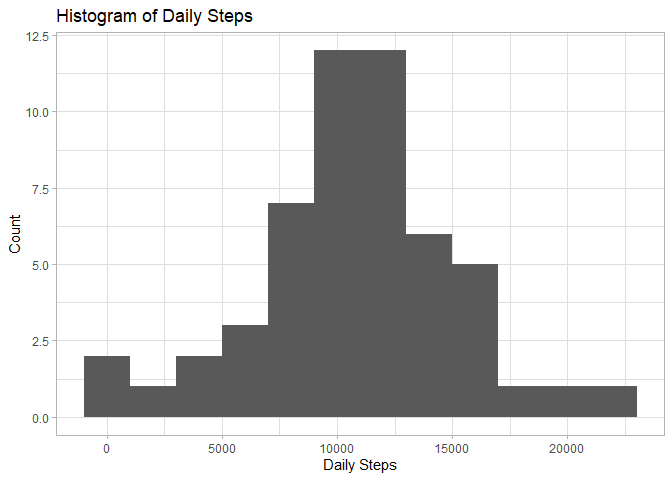
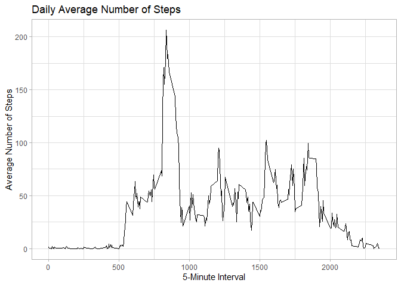
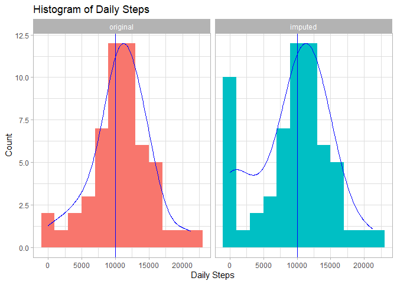
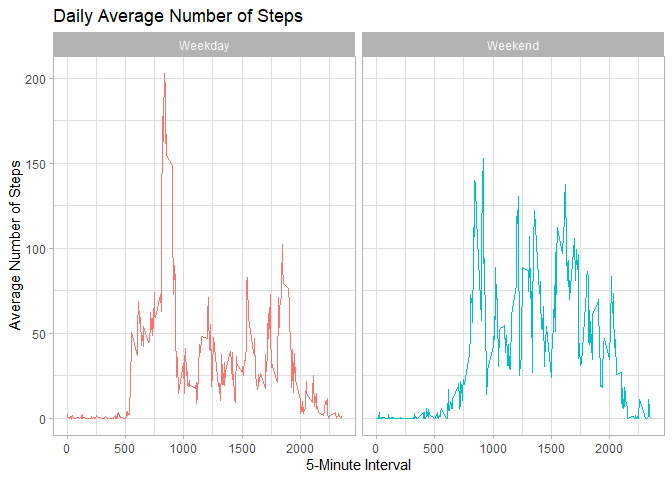

github repo for rest of specialization: [Data Science Coursera](https://github.com/mGalarnyk/datasciencecoursera)

## Introduction

It is now possible to collect a large amount of data about personal movement using activity monitoring devices such as a Fitbit, Nike Fuelband, or Jawbone Up. These type of devices are part of the "quantified self" movement -- a group of enthusiasts who take measurements about themselves regularly to improve their health, to find patterns in their behavior, or because they are tech geeks. But these data remain under-utilized both because the raw data are hard to obtain and there is a lack of statistical methods and software for processing and interpreting the data.

This assignment makes use of data from a personal activity monitoring device. This device collects data at 5 minute intervals through out the day. The data consists of two months of data from an anonymous individual collected during the months of October and November, 2012 and include the number of steps taken in 5 minute intervals each day.

The data for this assignment can be downloaded from the course web site:

-   Dataset: [Activity monitoring data](https://d396qusza40orc.cloudfront.net/repdata%2Fdata%2Factivity.zip)

The variables included in this dataset are:

steps: Number of steps taking in a 5-minute interval (missing values are coded as 𝙽𝙰) </br> date: The date on which the measurement was taken in YYYY-MM-DD format </br> interval: Identifier for the 5-minute interval in which measurement was taken </br> The dataset is stored in a comma-separated-value (CSV) file and there are a total of 17,568 observations in this dataset.

## Loading and preprocessing the data

Unzip data to obtain a csv file.

``` r
options(scipen = 1)

library(ggplot2)
library(tidyverse)
```

    ## ── Attaching packages ─────────────────────────────────────── tidyverse 1.3.2 ──
    ## ✔ tibble  3.1.8     ✔ dplyr   1.0.9
    ## ✔ tidyr   1.2.0     ✔ stringr 1.4.0
    ## ✔ readr   2.1.2     ✔ forcats 0.5.1
    ## ✔ purrr   0.3.4     
    ## ── Conflicts ────────────────────────────────────────── tidyverse_conflicts() ──
    ## ✖ dplyr::filter() masks stats::filter()
    ## ✖ dplyr::lag()    masks stats::lag()

``` r
setwd("D://personal//coursera - data science in R//coursera - 05 Reproducible research//proj1")
fileUrl <- "https://d396qusza40orc.cloudfront.net/repdata%2Fdata%2Factivity.zip"
download.file(fileUrl, destfile = "repdata%2Fdata%2Factivity.zip")
unzip("repdata%2Fdata%2Factivity.zip",exdir = "data")
```

## Reading csv Data into Data.Table.

``` r
activity <- read_csv("data/activity.csv")
```

    ## Rows: 17568 Columns: 3
    ## ── Column specification ────────────────────────────────────────────────────────
    ## Delimiter: ","
    ## dbl  (2): steps, interval
    ## date (1): date
    ## 
    ## ℹ Use `spec()` to retrieve the full column specification for this data.
    ## ℹ Specify the column types or set `show_col_types = FALSE` to quiet this message.

## What is mean total number of steps taken per day?

1.  Calculate the total number of steps taken per day

``` r
activity.daily <- group_by(activity, date) %>% 
  summarize(steps = sum(steps))
```

2.  If you do not understand the difference between a histogram and a barplot, research the difference between them. Make a histogram of the total number of steps taken each day.

``` r
ggplot(activity.daily, aes(steps)) + 
  geom_histogram(binwidth = 2000) +
  labs(title = "Histogram of Daily Steps",
       x     = "Daily Steps",
       y     = "Count") +
  theme_light()
```

    ## Warning: Removed 8 rows containing non-finite values (stat_bin).

<!-- -->

3.  Calculate mean and median of the total number of steps taken per day

``` r
daily.steps.mean   <- mean(activity.daily$steps,   na.rm = T)
daily.steps.median <- median(activity.daily$steps, na.rm = T)
```

-   Mean of total number of steps taken per day: 10766.19
-   Median of the total number of steps taken per day: 10765

## What is the average daily activity pattern?

1.  Make a time series plot (i.e. type = "l") of the 5-minute interval (x-axis) and the average number of steps taken, averaged across all days (y-axis)

``` r
activity.interval <- group_by(activity, interval) %>% 
  summarize(avg.steps = mean(steps, na.rm = T))
ggplot(activity.interval, aes(interval, avg.steps)) +
  geom_line() +
  labs(title = "Daily Average Number of Steps",
       x     = "5-Minute Interval",
       y     = "Average Number of Steps") +
  theme_light()
```

<!-- -->

2.  Which 5-minute interval, on average across all the days in the dataset, contains the maximum number of steps?

``` r
knitr::kable(top_n(activity.interval, 1, avg.steps))
```

| interval | avg.steps |
|---------:|----------:|
|      835 |  206.1698 |

## Imputing missing values

1.  Calculate and report the total number of missing values in the dataset (i.e. the total number of rows with 𝙽𝙰s)

``` r
summary(activity$steps)["NA's"]
```

    ## NA's 
    ## 2304

2.  Devise a strategy for filling in all of the missing values in the dataset. The strategy does not need to be sophisticated. For example, you could use the mean/median for that day, or the mean for that 5-minute interval, etc.

``` r
activity <- mutate(activity, steps.imputed = NA) %>% 
  select(steps, steps.imputed, date, interval)
for (i in 1:nrow(activity)) {
  
  # Identify rows with NA
  
  if(is.na(activity$steps[i])) {
    
    # Get previous step count
    # If no previous value exists (i.e. row 1), default to zero steps
    
    previous.row   <- (i - 1)
    previous.steps <- ifelse(previous.row < 1, 0,
                             activity$steps.imputed[previous.row])
    
    # Get next step count
    # If no next value exists (i.e beyond last row), default to previous steps
    
    next.row <- i + 1
    
    while(is.na(activity$steps[next.row] & next.row <= nrow(activity))) {
      next.row = next.row + 1
    }
    
    next.steps <- ifelse(next.row > nrow(activity),
                         previous.steps,
                         activity$steps[next.row])
    
    # Impute NA as average between values
    
    imputed.steps <- mean(c(previous.steps, next.steps))
    activity$steps.imputed[i] <- imputed.steps
    
  } else { activity$steps.imputed[i] <- activity$steps[i] }
}
rm(list = c("i",
            "imputed.steps",
            "next.row",
            "next.steps",
            "previous.row",
            "previous.steps"))
```

3.  Create a new dataset that is equal to the original dataset but with the missing data filled in.

``` r
activity.imputed <- select(activity, steps.imputed, date, interval) %>% 
  rename(steps = steps.imputed)
```

4.  Make a histogram of the total number of steps taken each day and calculate and report the mean and median total number of steps taken per day. Do these values differ from the estimates from the first part of the assignment? What is the impact of imputing missing data on the estimates of the total daily number of steps?

``` r
activity.daily.imputed <- group_by(activity.imputed, date) %>% 
  summarize(steps = sum(steps))
# Join daily average data frames with original and imputed data
activity.daily.long <- full_join(activity.daily,
                                 activity.daily.imputed,
                                 by = c("date" = "date")) %>% 
  rename(original = steps.x, imputed = steps.y) %>% 
  gather(data, steps, -date) %>% 
  mutate(data = factor(data, levels = c("original", "imputed")))
# Create histogram with facets
ggplot(activity.daily.long, aes(steps, fill = data)) + 
  geom_histogram(binwidth = 2000) +
  geom_density(alpha  = 0, aes(y = ..scaled.. * 12),
               adjust = 1.5,
               color  = "blue",
               size = 0.5) +
  geom_vline(aes(xintercept = mean(steps, na.rm = T)),
             color    = "blue",
             size     = 0.5) +
  labs(title = "Histogram of Daily Steps",
       x     = "Daily Steps",
       y     = "Count") +
  facet_grid(. ~ data) +
  theme_light() +
  theme(legend.position = "none")
```

    ## Warning: Removed 8 rows containing non-finite values (stat_bin).

    ## Warning: Removed 8 rows containing non-finite values (stat_density).

<!-- -->

``` r
# Spread daily data frame to create summary table
activity.daily.wide <- spread(activity.daily.long, data, steps) %>% 
  rename(original.steps = original, imputed.steps = imputed)
# Get mean and median summaries
knitr::kable(summary(activity.daily.wide)[c(3,4), c(2,3)])
```

|     | original.steps | imputed.steps |
|:----|:---------------|:--------------|
|     | Median :10765  | Median :10395 |
|     | Mean :10766    | Mean : 9354   |

## Are there differences in activity patterns between weekdays and weekends?

1.  Create a new factor variable in the dataset with two levels -- "weekday" and "weekend" indicating whether a given date is a weekday or weekend day.

``` r
# Just recreating activityDT from scratch then making the new factor variable. (No need to, just want to be clear on what the entire process is.) 
activity.weekdays.imputed <- mutate(activity, weekdays = weekdays(date)) %>% 
  
  # Create new column reclassifying M-F as weekday and S-S as weekend
  
  mutate(weekends = ifelse(weekdays == "Saturday" | weekdays == "Sunday",
                           "Weekend", "Weekday")) %>% 
  select(-c(steps, weekdays)) %>% 
  rename(steps    = steps.imputed,
         weekdays = weekends)
```

2.  Make a panel plot containing a time series plot (i.e. type = "l") of the 5-minute interval (x-axis) and the average number of steps taken, averaged across all weekday days or weekend days (y-axis). See the README file in the GitHub repository to see an example of what this plot should look like using simulated data.

``` r
activity.weekdays.interval <- group_by(activity.weekdays.imputed,
                                       weekdays,
                                       interval) %>% 
  summarize(avg.steps = mean(steps, na.rm = T))
```

    ## `summarise()` has grouped output by 'weekdays'. You can override using the
    ## `.groups` argument.

``` r
ggplot(activity.weekdays.interval, aes(interval, avg.steps, color = weekdays)) +
  geom_line() +
  facet_wrap(. ~ weekdays) +
  labs(title = "Daily Average Number of Steps",
       x     = "5-Minute Interval",
       y     = "Average Number of Steps") +
  theme_light() +
  theme(legend.position = "none")
```

<!-- -->
